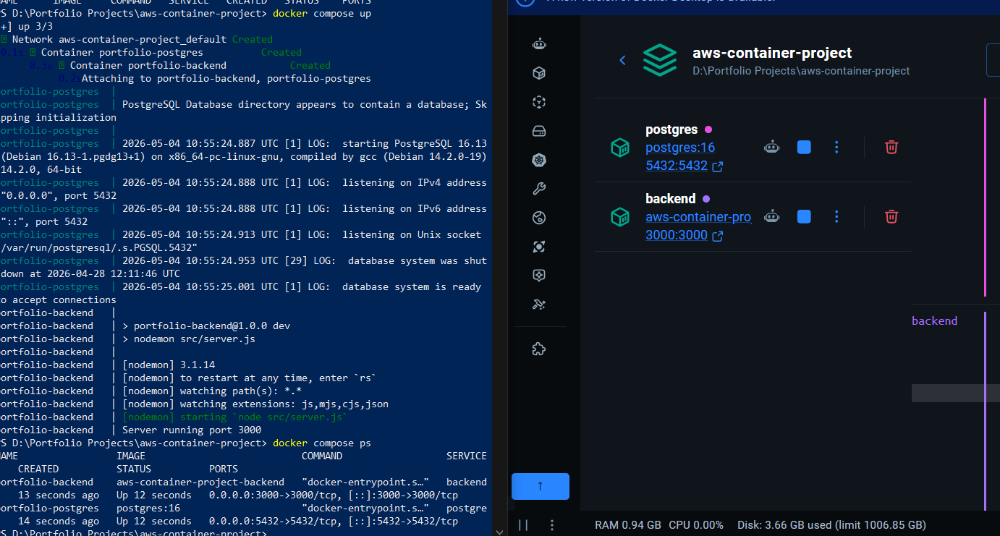
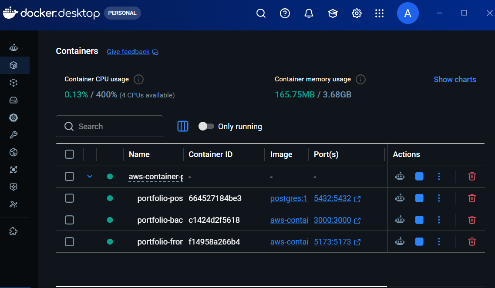
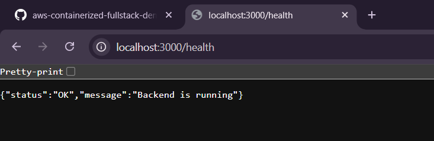
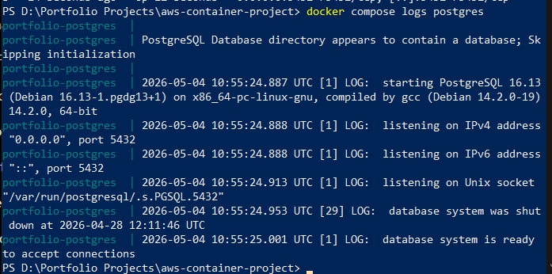
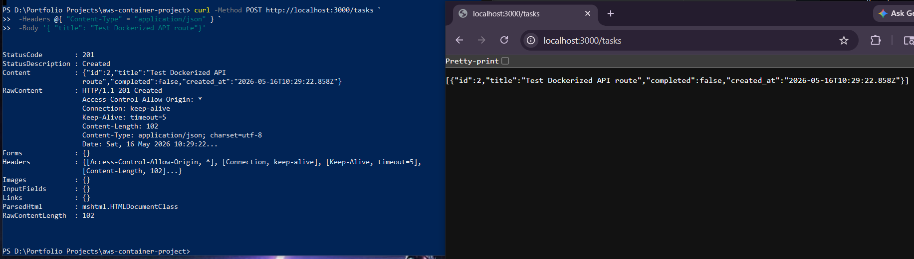
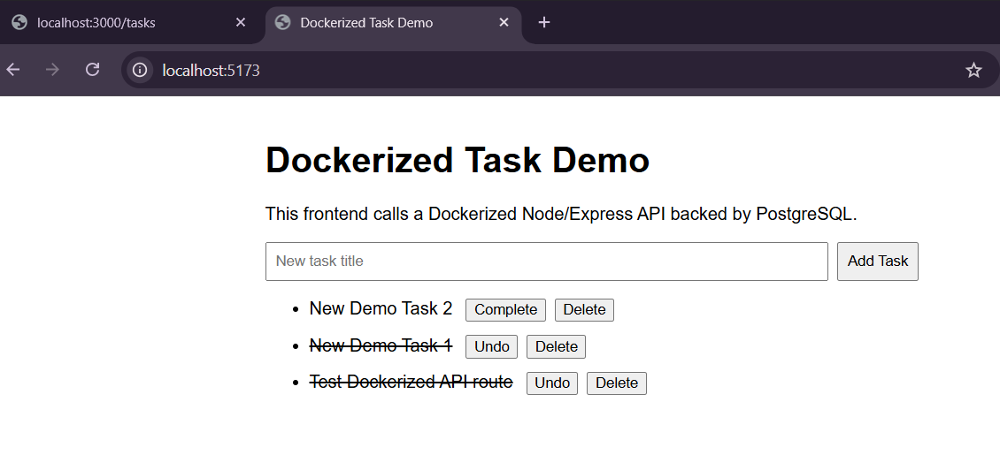
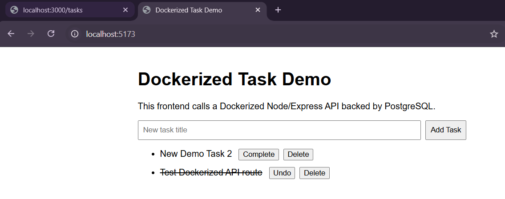

# Docker Notes

## Purpose

This project uses Docker to run the application in isolated containers. The goal is to make the local development environment consistent, repeatable, and easier to transition into cloud container services such as AWS ECS.

## Local Container Architecture

The local project uses Docker Compose to run three services:

```text
React Frontend Container
        ↓
Node/Express Backend Container
        ↓
PostgreSQL Database Container
```

## Services

### Frontend
The frontend is a React/Vite Application served on http://localhost:5173 <br><br>

The frontend container runs the Vite development server and sends API requests to the backend at http://localhost:3000

### Backend
The backend is a Node.js/Express API served at http://localhost:3000<br><br>

Current API endpoints include:<br>
- GET       /health
- GET       /db-test
- GET       /tasks
- POST      /tasks
- PATCH     /tasks/:id
- DELETE    /tasks/:id

### PostgreSQL
PostgreSQL runs in its own container in local port 5432. The database is initialized using database/init.sql <br>
The script creates the "tasks" table when the database volume is first created.

### Images vs Containers
A Docker image is the blueprint for the application environment <br><br>
A container is a running instance of an image (think Class vs Object).<br><br>
In this project: Dockerfile -> Image -> Container.

## Docker Compose
Docker compose is used to start and manage multiple services togther. <br><br>
Using command: docker compose up --build <br>
- Builds frontend and backend images
- pulls PostgreSQL image
- creates containers
- starts the full local application stack
Using command: docker compose down <br>
Stops the containers but keeps the PostgreSQL volume unless -v flag is used.

## Networking
Docker Compose creates a private network for the services.<br>
Inside that network, containers can communicate using service names. <br>
For example, the backend connects to PostgreSQL using DB_HOST = postgres. <br>

## Ports
Port mappings expose container services to the local machine. Current Mappings:
- Frontend:     5173:5173
- Backend:      3000:3000
- PostgreSQL:   5432:5432

These mappings allow access between each service.

## Volumes
The PostgreSQL service uses a named Docker Volume: postgres_data.<br>
This keeps the database data even if the PostgreSQL container is stopped or recreated. The volume is defined in the docker-compose.yml under volumes.<br><br>
To stop containers while keeping database data:<br>
docker compose down <br>
To stop containers and deleting data:<br>
docker compose down -v

## Environmental Variables
The backend receives database connection values from docker-compose.yml:<br>
environment: <br>
    PORT: 3000<br>
    DB_HOST: postgres<br>
    DB_PORT: 5432<br>
    DB_USER: portfolio_user<br>
    DB_PASSSWORD: portfolio_password<br>
    DB_NAME: porfolio_db<br>

These values are read in the backend using:
- process.env.DB_HOST
- process.env.DB_USER
- process.env.DB_PASSWORD
- process.env.DB_NAME <br>

For production deployment, sensitive values should not be hard coded in source files. They should be managed using environmental variables, AWS Secrets Manager, or another secure configuration system.

## Current Development Workflow
Using powershell within the project directory
#### Start Project
docker compose up --build
#### Detach Docker
press d in docker Compose watch mode
#### Check Running Containers
docker compose ps
#### View Backend Logs
docker compose logs backend
#### View Frontend Logs
docker compose logs frontend
#### View PostgreSQL Logs
docker compose logs postgres
#### Stop Project
docker compose down


## Screenshots (Docker)

### Backend & Postgre Containers in Docker


### Frontend added to Docker Containers


### Backend Health Check


### PostgreSQL Initialized


### Task API Persistence Demo


### Frontend UI Task Creation


### Frontend UI Task Deletion
